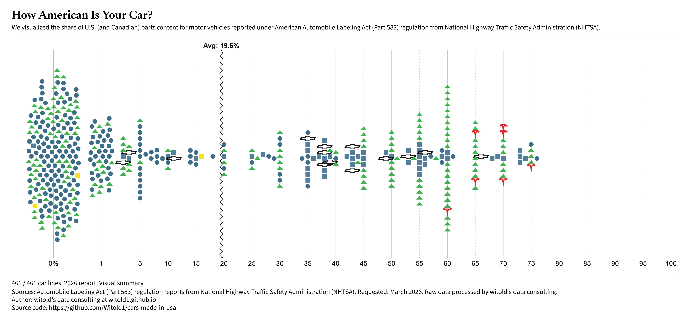

# How American Is Your Car?

[](https://witold1.github.io/cars-made-in-usa/)<br>


<br>

<br>


## Preview

<p align="center">
  
</p>

Interactive dashboard of U.S./Canadian parts content for passenger vehicle carlines, based on public NHTSA American Automobile Labeling Act (Part 583) releases.

## Description


### 1. Views


| View                 | Meaning                                                              |
| -------------------- | -------------------------------------------------------------------- |
| Exploration widget   | Year → make → model lookup for one carline’s content and origins     |
| Visual summary       | One point per carline; U.S./Canadian parts content on the value axis |
| Visual comparison    | Same data, one small chart per HQ region under a reference strip     |
| Data table           | Extended release rows (foreign parts, origins, assembly)             |
| Placeholder          | Reserved slot for a future chart type                                |
| Artificially generated table | Searchable / sortable carline rows                          |


Hover points for model, corporation, brand, and content %.

### 2. Controls

Top bar:

- **View** - switch chart / table type
- **Theme** - light or dark
- **Save PNG** - export the chart (default: Preset size = wide high-res for sharing; WYS = as on screen)
- **Settings (gear)** - dataset filters position, chart orientation (beeswarm), PNG mode, experimental brand emblems (filters / Page / tables)

Dataset filters:

- **Report** - shared AALA report year for charts and Origins (default: 2026 interim data)
- HQ region / corporation / brand hierarchy
- Optional marker style customization
- Legend toggles mirror the same selections

URL query params keep chart type and filters shareable (`?chart=beeswarm&regions=…`).

## Data

  * Data comes from **[Part 583 American Automobile Labeling Act Reports](https://www.nhtsa.gov/part-583-american-automobile-labeling-act-reports)** shared to public by National Highway Traffic Safety Administration. For more details and context of this regulation, see _Title 49 CFR Part 583 - Automobile Parts Content Labeling_ on _[Electronic Code of Federal Regulations (eCFR)](https://www.ecfr.gov/current/title-49/subtitle-B/chapter-V/part-583)_ or _[Legal Information Institute, Cornell University](https://www.law.cornell.edu/cfr/text/49/part-583)_. In addition, you can check the ["Evaluation of the American Automobile Labeling Act (NHTSA Publication DOT HS 809 208)"](https://crashstats.nhtsa.dot.gov/Api/Public/ViewPublication/809208), a report from January 2001 that stated "most consumers were unaware of the existence of the AALA labels".

Source of truth is JSON under `data/`:

- `meta.json` - dataset title, schema version, default release (`2026-draft`)
- `sources.json` - bibliography keyed by id (NHTSA, CFR, …)
- `carlines.json` - legacy synthetic plot points (not used by the live dashboard)
- `releases/index.json` - release dropdown order and labels (charts + Origins table)
- `releases/{id}.json` - one release each (`*-draft` from interim Excel + small mocks)

Field notes and editing rules live in `[data/README.md](data/README.md)`. Origins row schema: `[docs/extended-data-plan.md](docs/extended-data-plan.md)`. Material changes should be logged in `[data/CHANGELOG.md](data/CHANGELOG.md)`.

U.S./Canadian `%` is as reported in public AALA listings. Foreign totals may be reported or derived (`100 − U.S./Canadian`). Major foreign sources follow **49 CFR §583.7(e)**. Corrections welcome: see `[CONTRIBUTING.md](CONTRIBUTING.md)`.

App loaders under `src/data/` import this folder. Draft releases are lazy-loaded so large pipeline files stay out of the initial bundle.

## Run locally

```powershell
npm install
npm run dev
```

Open the printed localhost URL (Vite default: `http://localhost:5173`).

Optional Docker:

```powershell
docker compose -f docker/docker-compose.yml up
```


## Repository layout

```text
index.html              Page shell (+ analytics loader)
public/
  analytics.js          GoatCounter + Clarity + GA4 (live only)
  privacy.html          Privacy overview for analytics/hosting
vite.config.js          Vite + Vue
docker/                 Dockerfile, compose, .dockerignore
.github/workflows/      GitHub Pages deploy

src/
  main.js               Boot + CSS entry
  App.vue
  index.css             Style barrel (@imports → Tailwind)
  components/
    Dashboard.vue       Shell (wires composables)
    charts/             Beeswarm, jitter, legend, placeholder
    filters/            Filter panel, markers
    tables/             Data + Origins tables
    layout/             Theme toggle
    debug/              Environment / debug panel
  composables/          Filters, chart view, layout, URL state
  config/               Version, footer, chart guides
  data/                 Thin loaders over /data JSON
  styles/               Theme tokens + feature CSS modules
  utils/                D3 helpers, PNG export, filters
data/
  meta.json
  sources.json          Citeable source ids
  SOURCES.md            Human-readable source notes
  carlines.json         Legacy synthetic points (unused by UI)
  releases/             Per-release JSON + index.json (charts + Origins)
  README.md             Dataset schema & methodology
  CHANGELOG.md
docs/
  extended-data-plan.md Origins parse / schema spec
CONTRIBUTING.md
LICENSE-DATA
```


## License & credit


| Part                                   | License                                                                    |
| -------------------------------------- | -------------------------------------------------------------------------- |
| Website code (`src/`, config, scripts) | [MIT](LICENSE)              |
| Dataset under `data/`                  | [CC BY-SA 4.0](LICENSE-DATA) |


*Made with AI. Curated by Human.*